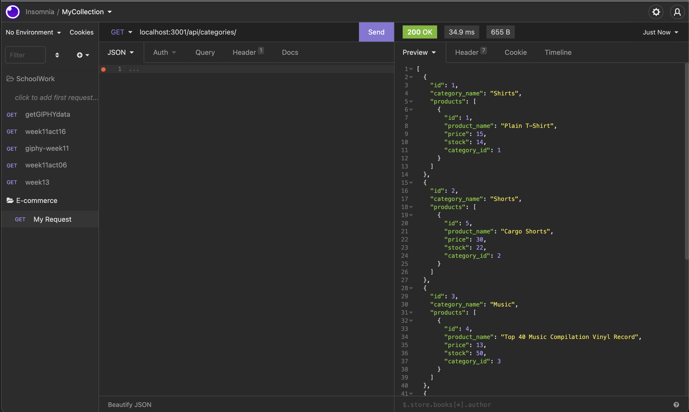
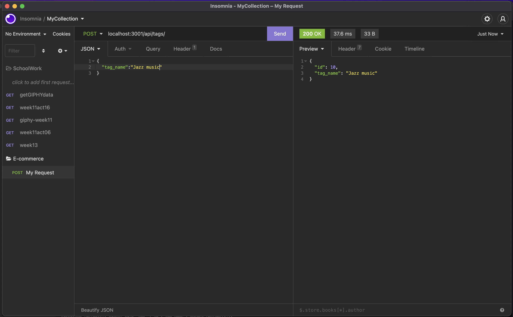

# Ecommerce_backend
Week 13: Object-Relational Mapping (ORM): E-Commerce Back End


## Description
The back end for an e-commerce site with Express.js API to use Sequelize to interact with a MySQL database

## Installation
First 
```
npm i
npm run seeds
npm start
```
Second: open Insomina then 
1) type in route 
2) choice GET POST PUT DELETE 
3) add JSON for POST and PUT 
4) click send


## Links
- [Github](https://github.com/fiona1nicdao/Ecommerce_backend) 

- [walkthrough video](https://watch.screencastify.com/v/AV5VtuWYlgothQVFXLwF)

## Licence 
 This project is licensed under the [MIT License](https://opensource.org/licenses/MIT).
 
## Preview



# Questions 
Please contact me direclty via the github [fiona1nicdao](<https://github.com/fiona1nicdao>) 
